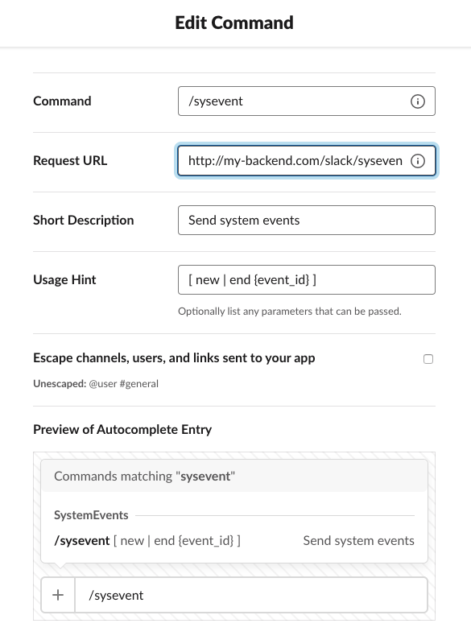
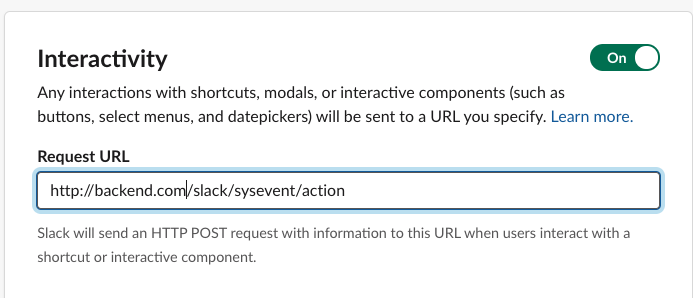
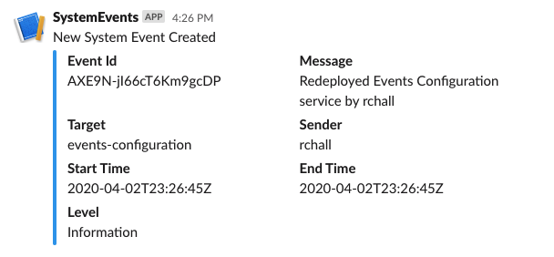
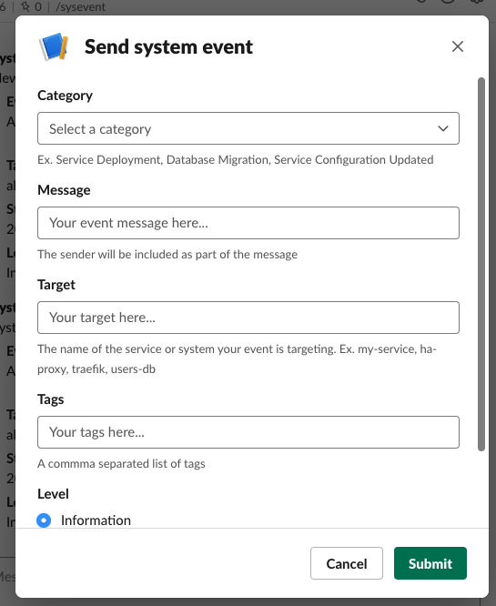

# System Events Slack App Backend

The system events slack backend can be used to create system events from slack.

## How to run the backend 

Before deploying the backend [create your slack app](https://api.slack.com/apps) in order to obtain the tokens required to setup the backend. 
You will need an oauth access token and a signed secret for configuring your backend service.

```
docker run --env-file path/to/envvars raulchall/system-events-slack-backend:latest 
```

### Configuration

- SYSTEM_EVENTS_SVC_URI
The Uri where your system event service is running

- SLACK_OAUTHACCESS_TOKEN
Your [slack oauth access token](https://api.slack.com/docs/oauth). Find it on your `OAuth & Permissions` tab of your slack app.

- SLACK_SIGNED_SECRET
Your slack [signed secret](https://api.slack.com/docs/verifying-requests-from-slack#about). Find it on the `Credentials` section of the `Basic Information` tab of your slack app.

Example content for `envvars` file
```
SYSTEM_EVENTS_SVC_URI=http://system-events
SLACK_OAUTHACCESS_TOKEN=your-token-here
SLACK_SIGNED_SECRET=your-secret-here
```

**Optional Configuration**

- SLACK_TEMPLATE_OPTION_SHOW_CUSTOM_CATEGORY 
Controls whether to show an input field on the slack form to allow users to create custom categories from slack. Values are true | false.

- SLACK_TEMPLATE_OPTION_SHOW_PREDEFINED_CATEGORY
Controls whether to show a select dropdown with the predefined categories on the slack form. Predefined categories are obtained from 
the Advance Configuration of the System Events Service. Values are true | false.

## Slack app setup

Assuming you already have a Slack app from the previous step and your backend is running at http://my-slack-backend/ then 

1. Create your slash command



Replace the `Request URL` field with: http://my-slack-backend/slack/sysevent
You can name your command however you want but the backend is expecting the subcommands: `new` and `end`

2. Enable Interactive Components



Replace the `Request URL` field with: http://my-slack-backend/slack/sysevent/action

3. (Recommended) Create Channel Webhook

In order to get a feedback from the channel you are using your commands you can create a [slack webhook](https://api.slack.com/messaging/webhooks) and configure 
the [System Events Service](../README.md) to send a notification there everytime an event is create/updated like this one.



Here is an example of the [System Events Service](../README.md) Advance Configuration you can use to accomplish this
```
categories:
  - name: '*'
    description: Allow all events

subscriptions:
  - type: slack
    category: '*'
    webhook_url: https://hooks.slack.com/services/Your/WebHook/Url
```

4. Save Changes and Verify

Save changes on your app and [add the app to your workspace](https://slack.com/help/articles/202035138-Add-an-app-to-your-workspace). In my case I created a new public channel on my workspace with the name `system-events` and installed my `SystemEvents App` there. 

Go to the channel where the app was installed and try out the slash command:

Type `/sysevent new` and **Send** should show the new system event form



5. Invite your cooworkers to the channel

